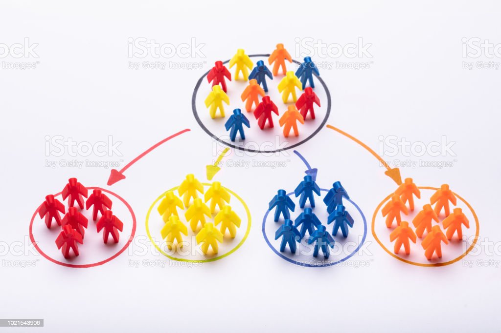

# Data Analysis And Customer Segments 

# 🛍️ Customer Sales Analysis using RFM and KMeans Clustering

This is a data analysis portfolio project focused on customer segmentation using RFM (Recency, Frequency, Monetary) analysis and KMeans clustering. The dataset contains transaction records from an online retail store.

## 📌 Objective

To explore customer behavior and identify customer segments that can be targeted for marketing and retention strategies using unsupervised learning techniques.

---

## 📂 Project Structure

- `data/` – Raw Excel dataset
- `notebooks/` – Jupyter notebooks with EDA, feature engineering, and modeling
- `figures/` – Visualizations generated during analysis
- `README.md` – Project overview
- `rfm_analysis.py` – Scripted pipeline for RFM and clustering

---

## 🧪 Tools & Libraries

- Python
- Pandas, NumPy
- Seaborn, Matplotlib
- Scikit-learn

---

## 📊 Steps Taken

### 1. **Data Cleaning**
- Removed missing `CustomerID` entries.
- Removed transactions with negative `Quantity`.

### 2. **Feature Engineering**
- Calculated `TotalSales` per transaction.
- Extracted time-based features from `InvoiceDate`.

### 3. **Exploratory Data Analysis (EDA)**
- Visualized monthly revenue trends.
- Analyzed product sales by hour and day.

### 4. **RFM Analysis**
- **Recency:** Days since last purchase.
- **Frequency:** Number of purchases.
- **Monetary:** Total money spent.

### 5. **Data Normalization**
- Applied `StandardScaler` to normalize RFM features.

### 6. **KMeans Clustering**
- Determined optimal number of clusters using:
  - Elbow method (Inertia)
  - Silhouette Score
- Applied final KMeans with 3 clusters.

### 7. **Insights**
- Identified:
  - Loyal and high-value customers (Cluster 1)
  - Potentially lost customers (Cluster 3)
  - Anomalous or unique customer behavior (Cluster 2)

---

## 🔍 Key Insights

- Most revenue is collected on Wednesdays at 19:00.
- Cluster 1 contains the most loyal and valuable customers.
- Cluster 3 customers are less frequent and spend less — potential churn risk.
- Cluster 2 is likely an outlier (single customer with massive purchases).

---

## ✅ Conclusion

This project demonstrates a practical application of RFM segmentation and unsupervised learning (KMeans) to uncover customer behavior insights. Such analysis can guide strategic decisions in marketing, customer retention, and sales targeting. 

Future work could include:
- Integrating customer lifetime value (CLV) predictions
- Automating segmentation updates over time
- Deploying a dashboard for real-time monitoring

---

## 📬 Contact

For questions or collaboration opportunities:

**Your Name**  
Eng Ali Mohammed  

